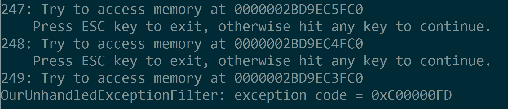
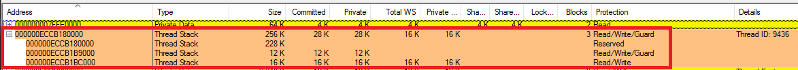
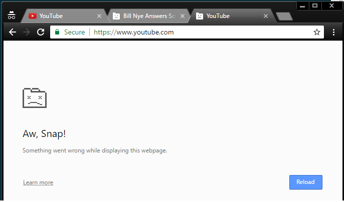
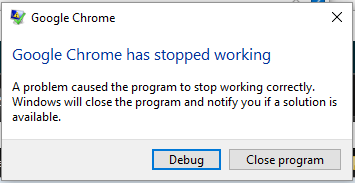
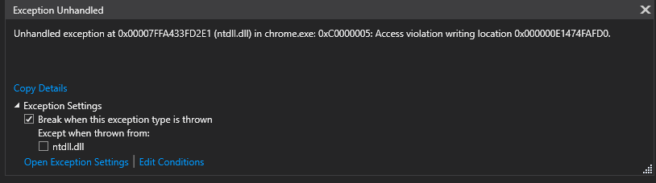
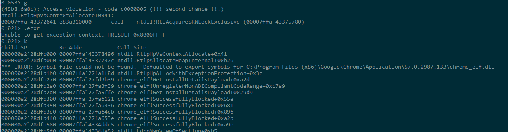
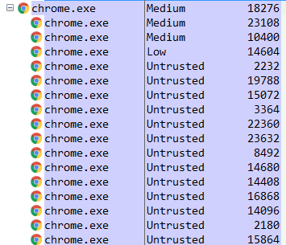

Broken Stack Guard Page
================================
Present 4 demo programs are showing how to break thread stack expansion in Windows. Stack area auto expansion is surprisingly fragile such that an application can even break other program's stack guard page and it can cause a clueless crash sometime later.

## Note ##
* How to compile and Run demo program
    1. Open Visual C++ command prompt.
    1. To compile, go to Src folder and enter `cl.exe /Ox /EHsc demoN.cpp` (N is number and currently 1, 2 or 3)
    1. Enter `demoX.exe` to run the demoX.

* As a first step, all demo programs get stack top address of main thread from [TIB](https://en.wikipedia.org/wiki/Win32_Thread_Information_Block) (Thread Information Block).

## Demo 1 ##
* In this demo, `AccessStackGuardMemory` function is simply trying to read memory address at the beginning of the one page (4KiB) above the current stack top address. (Remember stack grows to lower address from higher address).
* Use this command line to compile `cl.exe /Ox /EHsc demo1.cpp /link /stack:262144` to set max stack size as 256KiB.
* It continues to move the memory pointer up by 1 page (in other words, subtract 0x1000 from the current address) and try to read `int` (4 bytes) value. You can hit any key other than ESC to continue to move to the next pages.
* This is essentially simulating nested function calls where each function allocates or uses 4KiB stack memory for local variables.
* The stack guard page is set up above the current stack top by Windows. Whenever this program is trying to access (read) a memory location in the guard page area, `STATUS_GUARD_PAGE_VIOLATION` exception occurs. This exception is caught by the Windows Kernel exception handler and it'll expand or commit current stack by 1 page. 
* When you keep hold a non-ESC key for a while, this program will eventually hit stackoverflow exception (0xC00000FD) because it'll hit the maximum stack size which is specified at link time. ([Default is 1MiB](https://msdn.microsoft.com/en-us/library/windows/desktop/ms686774(v=vs.85).aspx))

    

* There is a linker option `/STACK:reserve[,commit]` sets the size of the stack. Default reserve size is 1 MiB. On my Windows 10, the minimum reserved stack size seems 256 KiB because the value is ignored if I specify smaller than 256 KiB.
* While running, launch [Vmmap.exe](https://technet.microsoft.com/en-us/sysinternals/vmmap.aspx) and select `demo1.exe` 

    

* Hit <Space> key and on the command window where `demo1.exe` is running to expand the stack then go back to the vmmap and refresh. You can see the commit memory is growing.

## Demo 2 ##
* This program tries to just **READ** main thread's stack guard pages from a **different** thread in same process.
* What this program does:
    1. Set up unhandled exception filter to catch and write to console when Windows structured exception is thrown.
    1. Create a new thread and passes main thread's stack limit address (stack top).
    1. In a new thread, try to read above the stack top address where main thread's stack guard page exists.
* You can see `STATUS_GUARD_PAGE_VIOLATION` (OurUnhandledExceptionFilter receives the exception) is thrown whenever try to access stack guard page. Normally when thread stack is grown and touched the guard page, the `STATUS_GUARD_PAGE_VIOLATION` exception is handled by Kernel code so you won't see the exception. However, in this demo, if the guard page is touched by **other** thread then no stack expansion happens. If you continue to hit <Space> key, it eventually tries to access above the stack guard pages and you will see `ACCESS_VIOLATION` exception.
* As far as I remember, in previous versions of Windows (Maybe including Windows 7 but not 100% sure), Windows didn't even throw the `STATUS_GUARD_PAGE_VIOLATION` exception but it just blew up the guard pages. This will lead to an obscure access violation crash some time later.

## Demo 3 ##
* Modified Demo 2 a little bit. `ThreadProc` accesses (3 pages) above the current stack top to break all 3 stack guard pages. Then calling `Crash()` function which allocates a large size local variable.
* The `Crash()` function throws `ACCESS_VIOLATION` and never returns.
* This program is showing that a random memory read on other thread stack's guard pages can cause access violation later. Although, this kind of crash should be very rare and probably almost never happen if your program is well-written.

## Demo 4 ##
This is the last demo showing the most interesting scenario. A malicious process is just doing **READ** access on the other process thread's stack guard page causes access violation crash of the victim process. An important thing is the access violation does not happen immediately after stack guard page is broken. It'll happen later when the thread start using more stack memory therfore the crash will be mostly clueless and a crash dump doesn't tell much about the whole story.

* Malicious process needs following privileges to target victim process.
    * `PROCESS_QUERY_INFORMATION | PROCESS_VM_READ | PROCESS_CREATE_THREAD`
* Executing `IsBadCodePtr` from the threads in the victim process.
    * This may be another good reason that Microsoft is trying to discontinue the `IsBadCodePtr` API (https://msdn.microsoft.com/en-us/library/windows/desktop/aa366712(v=vs.85).aspx)
* Let's crash Google Chrome browser:
    1. Compile command line is slightly different for this demo
        * Use `cl.exe /Ox /EHsc demo4.cpp Shlwapi.lib`
    1. Launch Chrome and load couple of tabs.
        * I opened 3 YouTube tabs.
    1. Run demo4.exe like below on command line. 
        * `demo4.exe chrome.exe`

        

    1. Go back to the Chrome browser click individual tab.
        * You are likely see some of tabs are crashed. If it's not crashing, you can try again or load other more expensive web site.

        

    1. Sometimes main Chrome process is killed that also kill all of its child processes then Windows Error Reporting dialog pops up.

         

    1. When you attach debugger, you will see something like below. It's access violation in random function. Unfortunately it won't tell what really happened.
    
        
        

* If you run demo4 process at [low integrity level](https://msdn.microsoft.com/en-us/library/bb625960.aspx), it cannot open chrome processes running at `medium` level. However, there are still chrome processes running at `low` and `untrusted` integrity level and demo4 be able to blow their stack guard pages. Although, it can't crash the main Chrome process since the parent Chrome process is running at `medium` level.    
    * Run this command to change integrity level (from Administrator command prompt) `icacls demo4.exe /setintegritylevel low`
     
    

## Conclusion ##
- The demo programs are showing how stack growing mechanism is fragile especially in multi-threaded environment. A subtle bug in one thread that inadvetently reads other thread's stack guard page area can crash the application.
- See this [Mark's blog](http://blogs.technet.com/b/markrussinovich/archive/2009/07/08/3261309.aspx) for thread stack expansion details.
- Allowing just `PROCESS_VM_READ` right can lead serious security issue like allowing crash your application from any other apps. See this [Blog](http://blogs.msdn.com/b/oldnewthing/archive/2006/01/17/513779.aspx) and [IsBadxxxPtr APIs are dangerous](http://blogs.msdn.com/b/larryosterman/archive/2004/05/18/134471.aspx) 
- .NET commits whole thread stack memory (no run-time growing). They've chosen reliability over more memory consumption.
- For game servers, I always **committed whole thread stack memory** at the thread initialization time especially for the worker threads in game server. I think eliminating run-time stack growing will give tiny bit of perf benefits as well. :)
